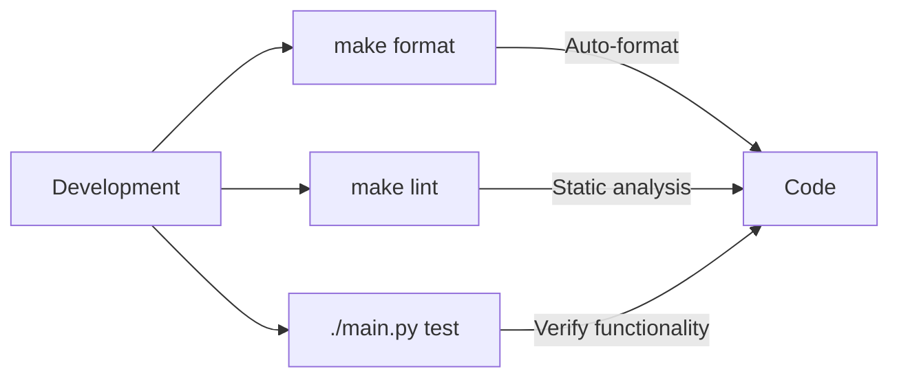

# Technology Stack

## Core Technologies
- Python 3.12+
- Typer (CLI framework)
- Rich (terminal formatting)
- httpx (HTTP client)

## Development Environment
- **Package Manager**: uv
- **Linting/Formatting**: Ruff
- **Type Checking**: mypy
- **Testing**: pytest (to be implemented)

## Tool Usage Patterns

## Dependencies
- See `pyproject.toml` for complete list
- Managed via uv lockfile

## Constraints
- Requires Python 3.12+
- Needs L1NKZIP_TOKEN for authenticated operations
